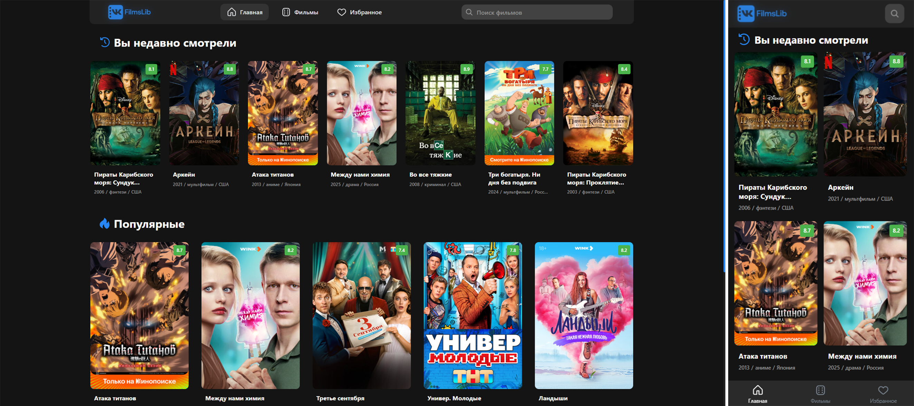
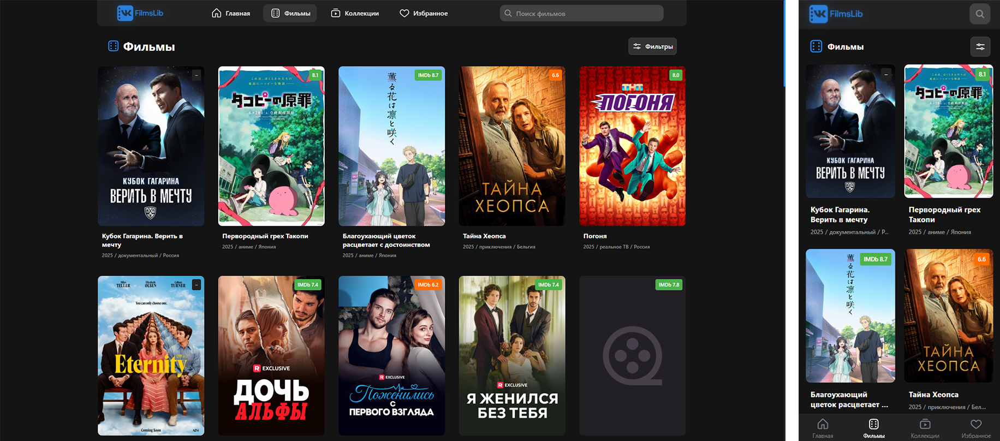
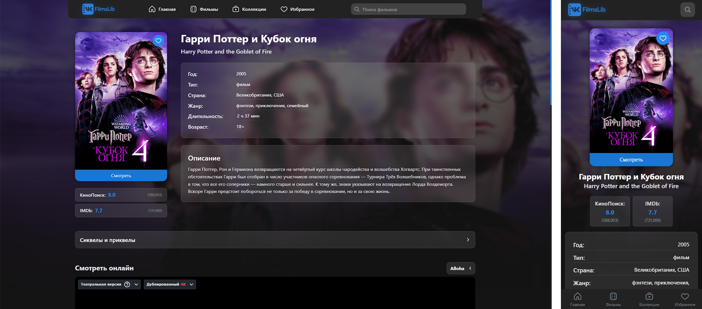
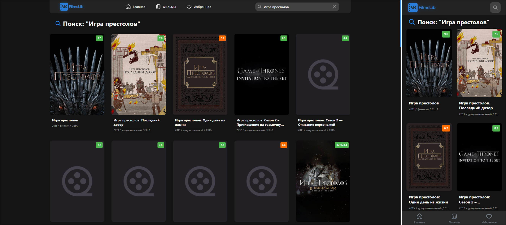
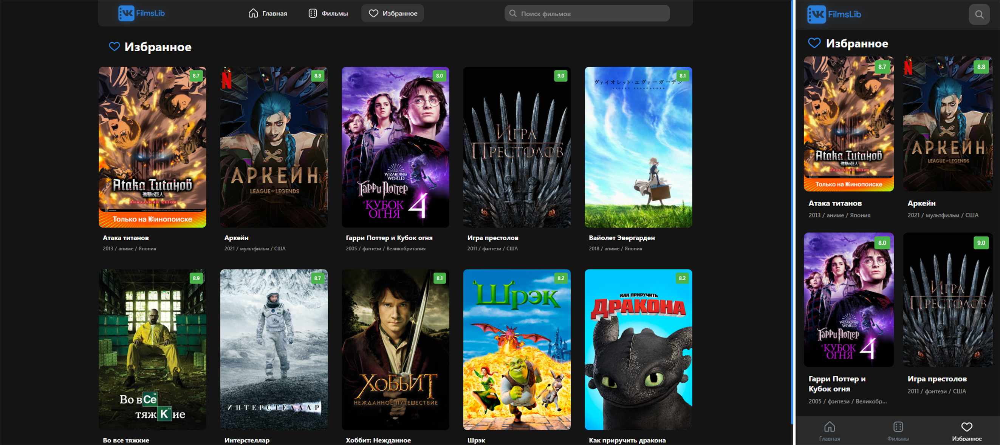
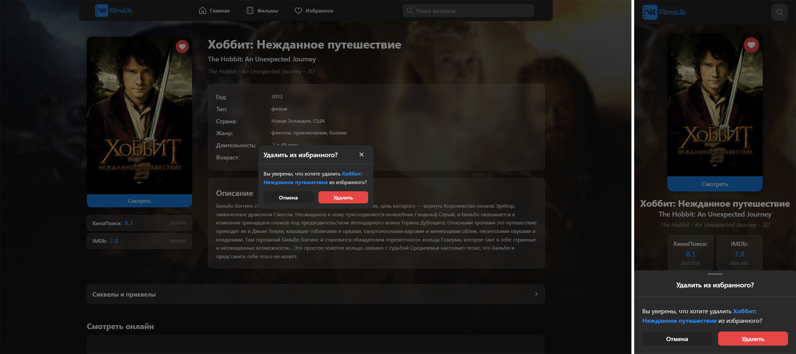

# 🎬 VK FilmsLib

**Современная библиотека фильмов с элегантным интерфейсом и мощным функционалом**

VK FilmsLib — это веб-приложение для поиска, просмотра и изучения фильмов, построенное на современных технологиях с акцентом на производительность и пользовательский опыт.

---

## 📸 Скриншоты

<!-- Место для скриншотов -->
<div align="center">
  
### Главная страница


### Страница фильмов и фильтров


### Страница фильма


### Поиск фильмов


### Избранное


### Добавление в избранное


</div>

---

## ✨ Основные возможности

### 🔍 **Умный поиск**
- Быстрый поиск по названию фильма
- Поиск по альтернативным названиям

### 🎯 **Продвинутые фильтры**
- Фильтрация по жанрам и странам
- Диапазон рейтингов (КиноПоиск, IMDb)
- Фильтр по годам выпуска
- Сохранение состояния фильтров в URL

### 📱 **Адаптивный дизайн**
- Полная поддержка мобильных устройств
- Оптимизация для планшетов

### 🎥 **Детальная информация о фильмах**
- Подробное описание и характеристики
- Рейтинги и списки рекомендованных фильмов
- Информация о сиквелах и приквелах
- Встроенный видеоплеер для просмотра(в разработке)

### 🔄 **Бесконечная прокрутка**
- Автоматическая подгрузка контента
- Оптимизированная производительность
- Плавная навигация

### 📚 **Коллекции и рекомендации**
- История просмотров
- Персональный список избранных фильмов
---

## 🛠 Технологический стек

### **Frontend**
- **React 18** — современная библиотека для создания пользовательских интерфейсов
- **TypeScript** — типизированный JavaScript для надежности кода
- **Vite** — быстрый сборщик и dev-сервер
- **React Router** — маршрутизация в приложении

### **Управление состоянием**
- **MobX** — реактивное управление состоянием
- **MobX React Lite** — интеграция с React

### **Стилизация**
- **SCSS/Sass** — препроцессор CSS
- **CSS Modules** — изолированные стили
- **VK Icons** — иконки от ВКонтакте

### **API и данные**
- **Axios** — HTTP клиент для запросов
- **КиноПоиск API** — источник данных о фильмах

### **Дополнительные возможности**
- **Infinite Scroll** — бесконечная прокрутка
- **URL State Management** — сохранение состояния в URL

---

## 🚀 Быстрый старт

### Предварительные требования
- Node.js 18+ 
- npm или yarn

### Установка

```bash
# Клонирование репозитория
git clone https://github.com/Mauzek/FilmLibrary.git
cd FilmLibrary

# Установка зависимостей
npm install

# Запуск в режиме разработки
npm run dev
```

### Сборка для продакшена

```bash
# Создание production сборки
npm run build

# Предварительный просмотр сборки
npm run preview
```

---

## 📁 Структура проекта

```
src/
├── 📂 api/              # API клиенты и конфигурация
├── 📂 assets/           # Статические ресурсы
├── 📂 components/       # React компоненты
│   ├── 📂 form/         # Формы и элементы ввода
│   ├── 📂 layout/       # Компоненты макета (Header, Footer, TabBar и т.д)
│   ├── 📂 shared/       # Переиспользуемые компоненты
│   └── 📂 ui/           # UI компоненты
├── 📂 сonfig/           # Конфигурация приложения
├── 📂 data/             # Статические данные
├── 📂 hooks/            # Пользовательские хуки
├── 📂 pages/            # Страницы приложения
│   ├── 📂 Favoutire/    # Избранное
│   ├── 📂 Main/         # Главная страница
│   ├── 📂 Movies/       # Каталог фильмов
│   ├── 📂 Search/       # Поиск
│   ├── 📂 NotFound/     # Страница 404
│   └── 📂 Movie/[id]/   # Детальная страница фильма
├── 📂 store/            # MobX стор
├── 📂 styles/           # Глобальные стили и переменные
├── 📂 types/            # TypeScript типы
└── 📂 utils/            # Утилиты и хелперы
```

---

## 🎨 Особенности дизайна

### **Темная тема**
- Современный темный интерфейс
- Высокий контраст для лучшей читаемости
- Плавные переходы и анимации

### **Адаптивность**
- Mobile-first подход
- Гибкая сетка и компоненты
- Оптимизация для всех устройств

### **Производительность**
- Ленивая загрузка изображений
- Виртуализация длинных списков
- Оптимизированные запросы к API

---

## 🔧 Конфигурация

### Переменные окружения

Создайте файл `.env.local`:

```env
VITE_API_BASE_URL=https://api.kinopoisk.dev
VITE_API_TOKEN=your_api_token_here
```

### Настройка API

Приложение использует API КиноПоиска. Для получения токена:
1. Перейдите на [kinopoisk.dev](https://kinopoisk.dev/)
2. Зарегистрируйтесь и получите API ключ
3. Добавьте ключ в переменные окружения

---

## 📱 Мобильная версия

VK FilmsLib полностью адаптирован для мобильных устройств:

- **Отзывчивый дизайн** для всех размеров экранов
- **Touch-friendly** интерфейс
- **Оптимизированная навигация** для мобильных устройств
- **Быстрая загрузка** на медленных соединениях

---

## 👨‍💻 Автор

**Mauzek**
- GitHub: [@Mauzek](https://github.com/Mauzek)
- Проект: [FilmLibrary](https://github.com/Mauzek/FilmLibrary)

---

## 🙏 Благодарности

- **КиноПоиск Dev** за предоставление API
- **VK Team** за иконки и дизайн-систему

---

<div align="center">

**⭐ Поставьте звезду, если проект вам понравился!**

[🐛 Сообщить об ошибке](https://github.com/Mauzek/FilmLibrary/issues) • [💡 Предложить улучшение](https://github.com/Mauzek/FilmLibrary/issues) • [📖 Документация](https://github.com/Mauzek/FilmLibrary/wiki)

</div>
